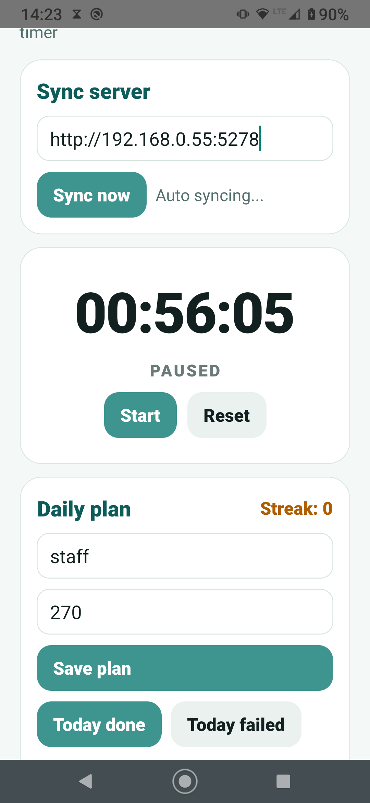
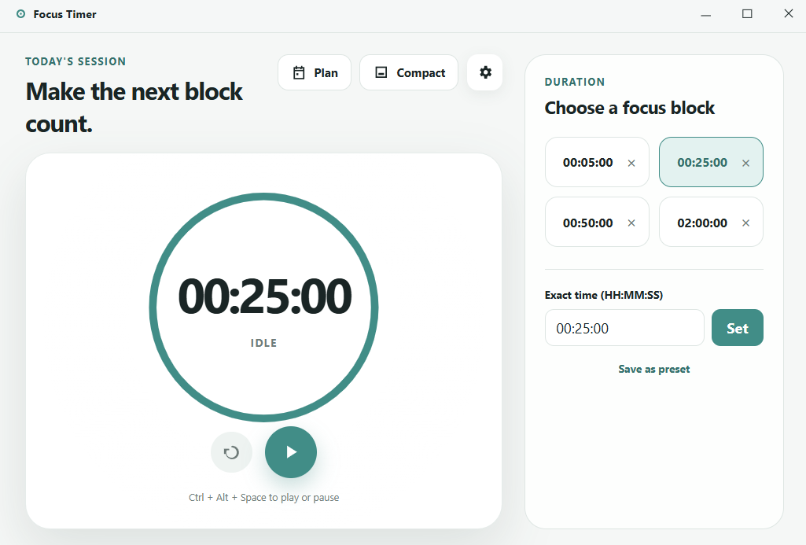
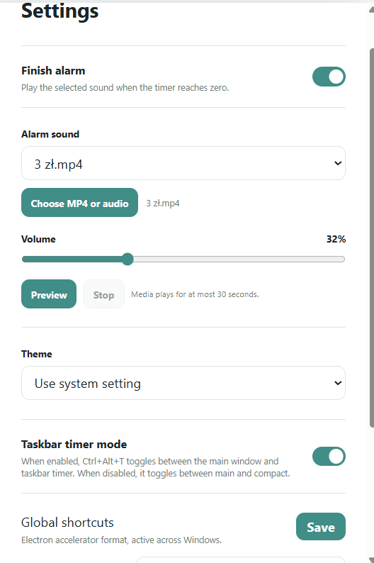
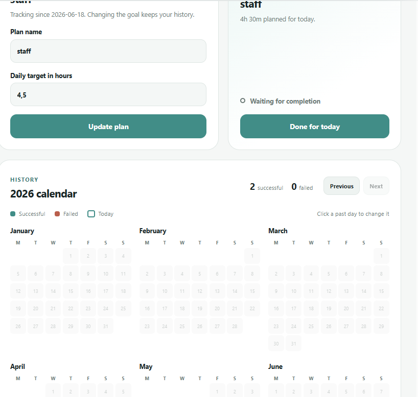

# Focus Timer - Electron + Android Sync

A local-first focus timer for Windows, Linux, and Android.

The desktop app is built with **Electron, React, TypeScript, and Vite**. It includes a full timer window, compact mode, Windows taskbar timer mode, custom focus blocks, custom alarm audio/video, global shortcuts, and a daily plan calendar.

The Android app is built with **React Native and TypeScript**. It can sync with the desktop app over the local network when the desktop app is running.

No cloud service is required.

## Screenshots

### Android App



### Desktop Overview



### Settings: Custom Audio And Shortcuts



### Daily Plan And Calendar



## Features

- Desktop timer for Windows and Linux.
- Full and compact timer modes.
- Windows-only taskbar timer mode.
- Exact `HH:MM:SS` timer input.
- Custom focus block presets.
- Global keyboard shortcuts.
- Built-in, Windows system, or custom MP4/audio finish alarm.
- Daily plan tracking with calendar history and streak.
- Android companion app.
- Local Wi-Fi sync between Android and the desktop app.
- Local Git-tracked codebase.

## Project Structure

```text
desktop/   Electron + React + TypeScript desktop app
mobile/    React Native + TypeScript Android companion app
docs/      README screenshots
```

## Desktop Development

```powershell
cd desktop
npm install
npm run dev
```

Build and package the Windows installer:

```powershell
cd desktop
npm run package:win
```

Build Linux packages on Linux:

```bash
cd desktop
npm run package:linux
```

## Downloads

Desktop installers are published from GitHub Releases:

[Download the latest release](https://github.com/KimboPulus/Custom-taskbar-timer-app-android-electron-sync/releases)

- Windows: download `Focus-Timer-Setup-<version>.exe` and run it.
- openSUSE/Fedora Linux: download the `.rpm` package and install it with your package manager.
- Debian/Ubuntu Linux: download the `.deb` package.
- Other common Linux distros: download the `.AppImage`, run `chmod +x <file>.AppImage`, then launch it.

To publish a new desktop release, push a tag that starts with `desktop-v`:

```powershell
git tag desktop-v1.5.7
git push origin desktop-v1.5.7
```

## Android Development

```powershell
cd mobile
npm install
.\scripts\build-android.ps1
```

Install the APK on a connected Android phone:

```powershell
cd mobile
.\scripts\install-android.ps1
```

## Local Sync

1. Launch the desktop app.
2. Make sure the phone and PC are on the same Wi-Fi network.
3. Find the PC IPv4 address with:

```powershell
ipconfig
```

4. In the Android app, enter:

```text
http://YOUR_PC_IP:5278
```

Example:

```text
http://192.168.0.55:5278
```

The desktop app hosts the local sync API. The Android app pushes its current state and receives the merged desktop snapshot back.

## Notes

This is a solo-dev local productivity project. It is designed for personal use on a trusted local network.

For stronger security, the next step would be adding a pairing token so only approved phones can sync with the desktop app.

Taskbar timer mode and Windows system sounds are Windows-only. Linux builds support the normal window, compact mode, daily plan calendar, custom media alarms, and local sync.
